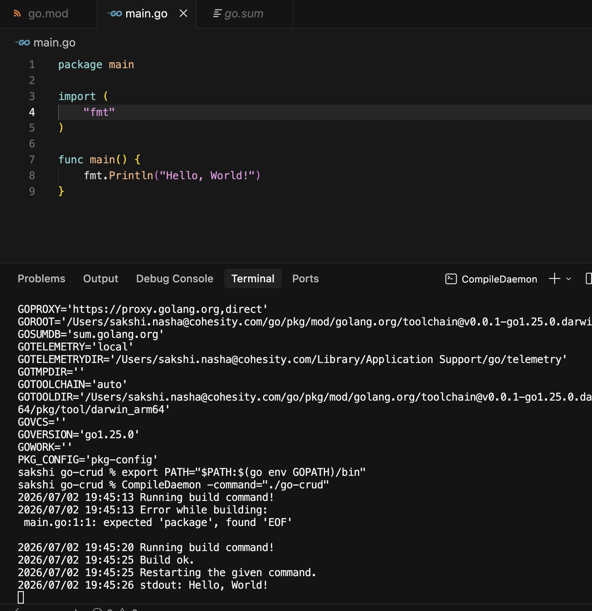
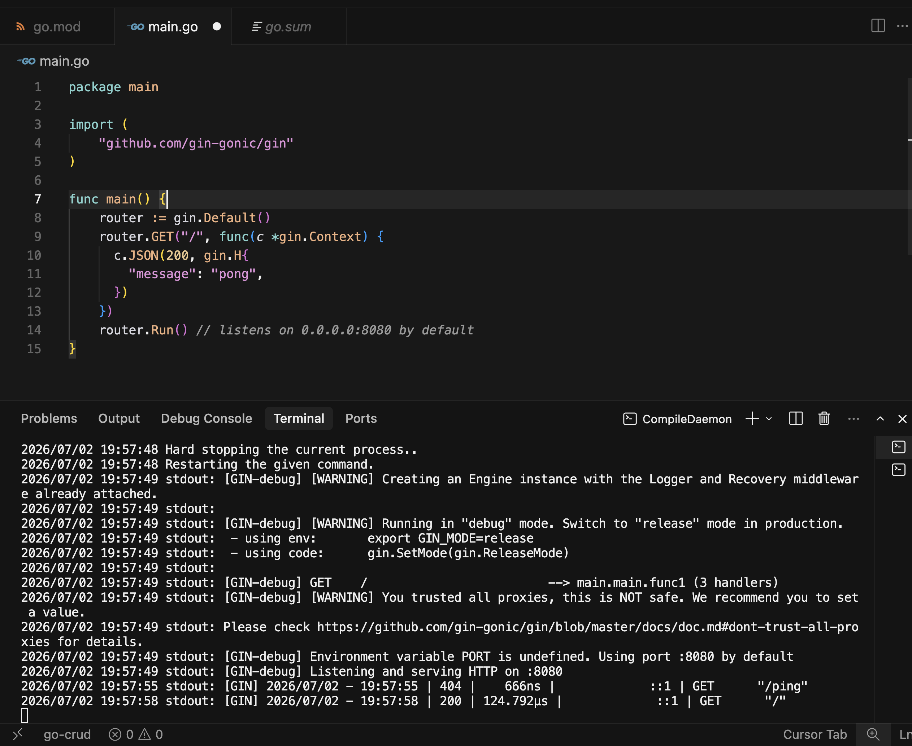
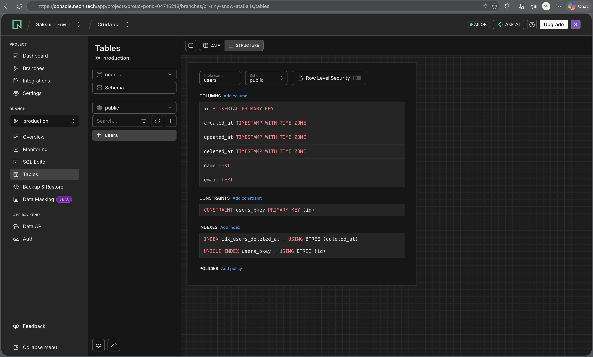
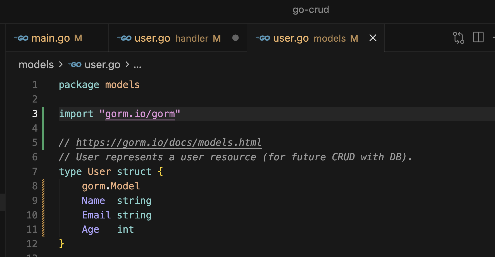
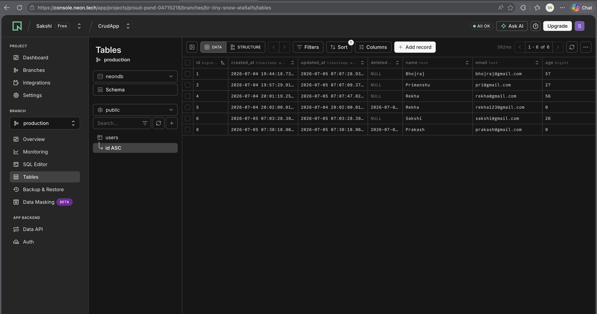
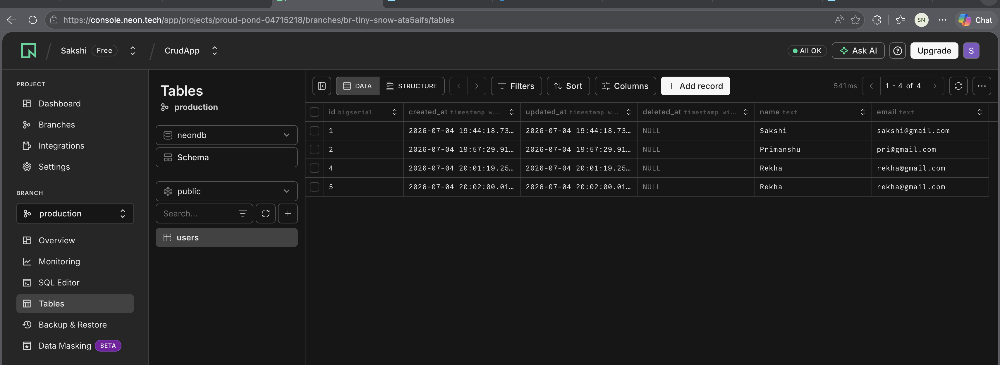
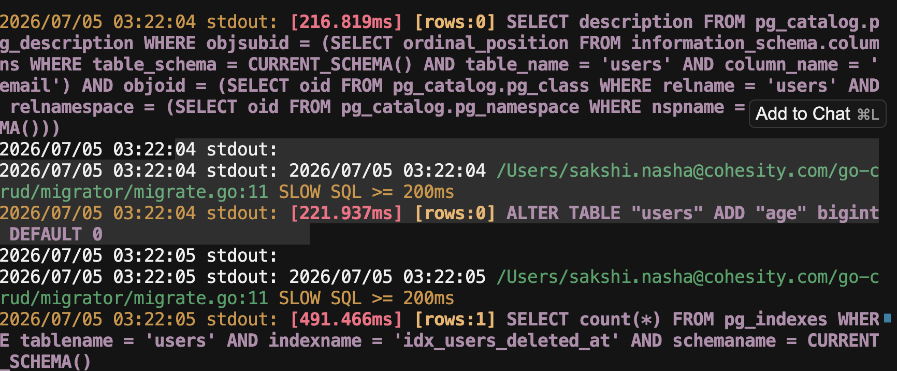
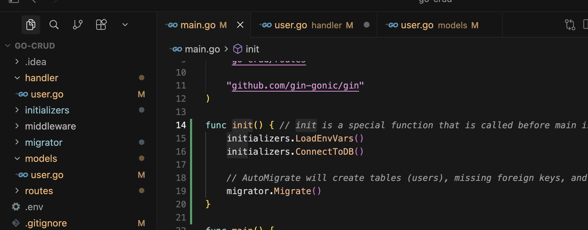
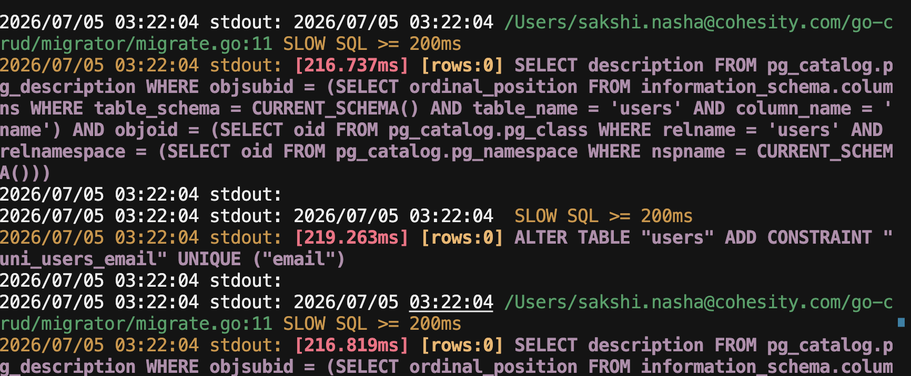
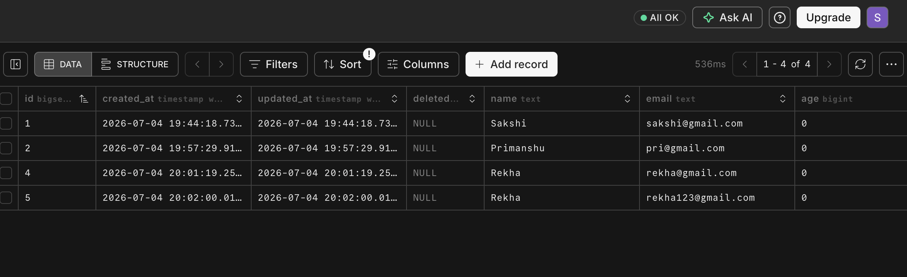

# User-crud-app

A RESTful User CRUD API built with **Go**, **Gin**, **GORM**, and **Neon PostgreSQL** — with env config via **godotenv** and hot-reload via **CompileDaemon**.

**Video tutorial:** [Go CRUD with Gin & GORM](https://youtu.be/lf_kiH_NPvM?si=D4orolnCDGQFEtzC)

---

## Tech Stack

| Tool | Purpose | Docs |
|------|---------|------|
| [Gin](https://gin-gonic.com/en/) | HTTP web framework / REST API | [Quickstart](https://gin-gonic.com/en/docs/quickstart/) |
| [GORM](https://gorm.io/) | ORM for PostgreSQL | [GORM Docs](https://gorm.io/docs/) |
| [godotenv](https://pkg.go.dev/github.com/joho/godotenv#section-readme) | Load `.env` config | [pkg.go.dev](https://pkg.go.dev/github.com/joho/godotenv) |
| [Neon](https://console.neon.tech/) | Serverless PostgreSQL | [Console](https://console.neon.tech/app/projects/proud-pond-04715218/branches/br-tiny-snow-ata5aifs/tables) |
| [CompileDaemon](https://pkg.go.dev/github.com/githubnemo/compiledaemon) | Auto rebuild on file save | [pkg.go.dev](https://pkg.go.dev/github.com/githubnemo/compiledaemon#section-readme) |

---

## Project Structure

```
go-crud/
├── main.go                 # Boot: DB, migrate, router, Run()
├── .env.example            # Env template (commit this)
├── handler/handler.go      # CRUD handlers
├── routes/routes.go        # URL → handler wiring
├── models/user.go          # User struct + GORM tags
├── middleware/cors.go      # CORS middleware (optional)
├── initializers/           # LoadEnvVars, DB connection
├── migrator/migrate.go     # AutoMigrate
├── postman/                # Postman collection
└── docs/images/            # README screenshots
```

---

## Setup

### 1. Install Go

Download from [go.dev/dl](https://go.dev/dl/) — tested with **Go 1.25+**.

```bash
go version
# go version go1.25.0 darwin/arm64
```

### 2. Clone & install dependencies

```bash
git clone git@github.com:wheresNasha/User-crud-app.git
cd User-crud-app

go mod download
```

Key packages (already in `go.mod`):

```bash
go get github.com/gin-gonic/gin
go get gorm.io/gorm
go get gorm.io/driver/postgres
go get github.com/joho/godotenv
go install github.com/githubnemo/CompileDaemon@latest
```

### 3. CompileDaemon PATH

If `CompileDaemon` is not found, add Go bin to PATH (`~/.zshrc`):

```bash
export PATH="$PATH:$(go env GOPATH)/bin"
```



### 4. Environment variables

```bash
cp .env.example .env
# Edit .env with your Neon credentials
```

**Never commit `.env`** — only `.env.example` with placeholders.

| Variable | Description |
|----------|-------------|
| `PORT` | API port (default `8080` if unset) |
| `DB_URL` | PostgreSQL connection string for Neon |

Example Neon connection:

```
host=YOUR_HOST user=neondb_owner password=YOUR_PASSWORD dbname=neondb port=5432 sslmode=require
```

---

## Run

**With hot reload (recommended):**

```bash
CompileDaemon -command="./go-crud"
```



**Or directly:**

```bash
go run .
```

API runs at `http://localhost:8080` (or your `PORT`).

---

## API Endpoints

| Method | Endpoint | Description |
|--------|----------|-------------|
| GET | `/users` | Get all users |
| GET | `/users/:id` | Get user by ID |
| POST | `/users` | Create user |
| PUT | `/users/:id` | Update full user |
| PATCH | `/users/:id` | Update age only |
| DELETE | `/users/:id` | Delete user (soft delete) |
| HEAD | `/users/:id` | Check if user exists |
| GET | `/users/search?name=&min_age=` | Search (optional query params) |
| GET | `/users/search2?name=&min_age=` | Search (mandatory query params) |

### Create user example

```bash
curl -X POST http://localhost:8080/users \
  -H "Content-Type: application/json" \
  -d '{"name":"Sakshi","email":"sakshi@gmail.com","age":25}'
```

---

## Postman

Import the collection into Postman:

```
postman/Go-Crud-App.postman_collection.json
```

**Steps:** Postman → **Import** → **Upload Files** → select JSON above.

Set base URL: `http://localhost:8080`

Collection includes: Create, Retrieve, Update, Patch, Delete, Head, Search (optional & mandatory query params).

---

## Database (Neon + GORM)

### Users table

Initial schema after first `AutoMigrate` run (before adding data or the `age` column):





### Sample data (after CRUD via Postman)

All user records visible in [Neon Console](https://console.neon.tech/app/projects/proud-pond-04715218/branches/br-tiny-snow-ata5aifs/tables) — includes `id`, `name`, `email`, `age`, and soft-delete (`deleted_at`):



### AutoMigrate — add new columns

When you add a field to `models/user.go` (e.g. `Age`), **restart the app** — `AutoMigrate` runs in `init()` on startup.

| AutoMigrate does | AutoMigrate does NOT |
|------------------|----------------------|
| Add new columns | Delete columns |
| Create tables | Change column types safely |
| Add indexes | Drop tables |

DB before adding age column



GORM runs SQL like:

```sql
ALTER TABLE users ADD COLUMN age bigint DEFAULT 0;
```

Existing rows get default values (`age = 0` for `int`).


CompileDaemon terminal log showing AutoMigrate in action:





### Unique email constraint

Add tag in `models/user.go`:

```go
Email string `gorm:"uniqueIndex"`
```

Restart app → GORM adds unique index on `email`.



Duplicate email returns error:



---

## How Gin handlers work (interview summary)

```
Client → Gin Router → Handler(c *gin.Context) → GORM → PostgreSQL
                              ↑
                    *gin.Context = one tray
                    IN:  c.Bind(), c.Param(), c.Query()
                    OUT: c.JSON()
```

- Handlers don't `return` data — they write to `c.JSON()`
- `c.Bind(&body)` reads JSON body; `c.Param("id")` reads URL path
- GORM `result` is for error checking; `user`/`users` is the data sent in response

---

## References

- [Gin Web Framework](https://gin-gonic.com/en/)
- [GORM ORM](https://gorm.io/)
- [godotenv](https://pkg.go.dev/github.com/joho/godotenv#section-readme)
- [CompileDaemon](https://pkg.go.dev/github.com/githubnemo/compiledaemon)
- [Neon Console — tables](https://console.neon.tech/app/projects/proud-pond-04715218/branches/br-tiny-snow-ata5aifs/tables)
- [Video tutorial](https://youtu.be/lf_kiH_NPvM?si=D4orolnCDGQFEtzC)

---

## Author

[Sakshi Nasha](https://github.com/wheresNasha)
